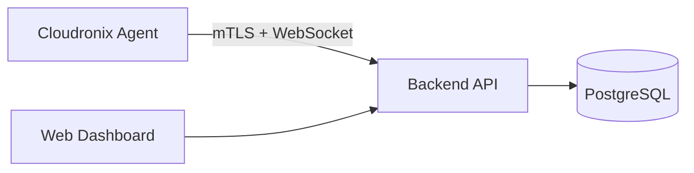

<h1>

<span style="vertical-align: middle; margin-bottom: 8px;">Cloudronix Agent</span>
</h1>
**The open-source endpoint agent for the Cloudronix RMM platform.**

Cloudronix is a modern Remote Monitoring and Management (RMM) solution designed for speed, security, and cross-platform automation. This repository contains the source code for the **Cloudronix Agent**, a lightweight binary that resides on managed endpoints to execute commands and report system health.

---

## The Cloudronix Ecosystem

Cloudronix operates on a hybrid model to balance transparency with powerful centralized management:

- **The Agent (Open Source):** This repository contains the Go-based agent. We open-source the agent to allow system administrators to audit the code running on their private infrastructure and to encourage community contributions to the automation engine.

- **The Control Plane (Proprietary):** The agent connects to the **Cloudronix Platform**, a high-performance, closed-source orchestration backend built with Rust and a centralized management dashboard built with SvelteKit.

---

## Architecture

The agent acts as the execution arm of the Cloudronix platform. It maintains a persistent, encrypted connection to the Control Plane to receive instructions and stream telemetry.



---

## Key Features

- **Cross-Platform Performance:** Native support for Windows (Service), Linux (systemd), and macOS (launchd) via a single Go codebase.

- **Security First:** Uses a one-time enrollment token to provision unique mTLS certificates. All communication with the Control Plane is encrypted and authenticated.

- **Automation Engine:** An embedded YAML-based execution engine capable of system hardening, software deployment, and configuration management.

- **Real-time Telemetry:** Streams CPU, memory, disk, and network metrics without the overhead of heavy monitoring tools.

---

## Building & Development

### Prerequisites

- **Go 1.21+**
- Access to a Cloudronix Platform instance for enrollment.

### Compilation

To build a local version of the agent for testing or auditing:

```bash
# Clone the repository
git clone https://github.com/alexandrosnt/cloudronix-agent.git
cd cloudronix-agent

# Build for the local architecture
go build -o cloudronix ./cmd/cloudronix-agent

# Cross-compile for other platforms
GOOS=windows GOARCH=amd64 go build -o cloudronix.exe ./cmd/cloudronix-agent
GOOS=linux GOARCH=amd64 go build -o cloudronix-linux ./cmd/cloudronix-agent
GOOS=darwin GOARCH=amd64 go build -o cloudronix-macos ./cmd/cloudronix-agent
```

---

## Connection & Enrollment

The agent requires a connection to a Cloudronix Control Plane. To enroll a device:

1. Log in to your **Cloudronix Dashboard**.
2. Navigate to **Add Device** and generate an enrollment token.
3. Run the agent with the enrollment flag:

```bash
./cloudronix enroll <YOUR_TOKEN>
```

Once enrolled, the device will appear in your dashboard and begin reporting telemetry.

---

## Installing as a Service

To run the agent persistently in the background, install it as a system service:

```bash
./cloudronix install
```

This registers the agent as:
- **Windows:** Windows Service
- **Linux:** systemd unit
- **macOS:** launchd daemon

The service starts automatically on boot and restarts on failure.

---

## Security & Auditability

We believe the software you run with administrative privileges should be transparent. By open-sourcing the agent, we allow users to:

- Verify exactly how system commands are executed.
- Audit the mTLS handshake and data transmission logic.
- Ensure that only authorized instructions from the Control Plane are processed.

---

## Contributing

We welcome contributions to the agent's automation capabilities, bug fixes, and OS-specific optimizations. For major changes, please open an issue first to discuss your ideas.

---

## License

The Cloudronix Agent is released under the **Apache 2.0 License**.

*Note: This license applies only to the agent source code found in this repository. The Cloudronix Control Plane (Backend and Frontend) remains proprietary software.*
